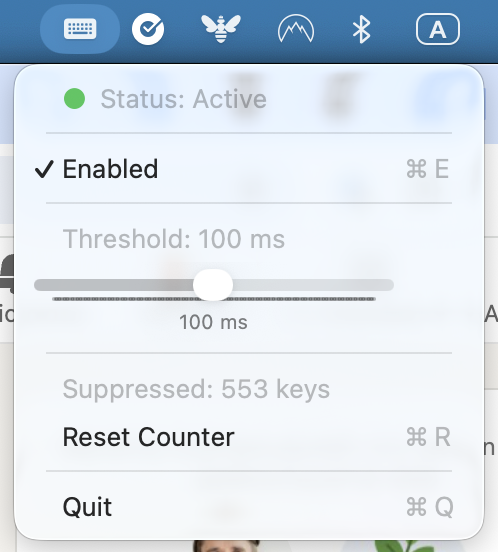

# Clattering

A lightweight macOS menu bar app that filters out keyboard chatter (duplicate keypresses) from mechanical keyboards.



## The Problem

Mechanical keyboards can develop "chatter" over time, where a single keypress registers multiple times. This is especially common with older switches or certain keyboard models (like the Roccat Vulcan series). Clattering solves this by detecting keypresses that occur too close together and suppressing the duplicates.

## Features

- **Per-key debouncing** - Each key is tracked independently, so pressing A won't affect B's debounce timer
- **Key-down and key-up filtering** - Catches chatter on both press and release
- **Configurable threshold** - Adjust from 1-200ms via a slider in the menu bar
- **Real-time status** - Green checkmark when active, yellow warning when starting
- **Auto-retry** - Automatically retries if permissions aren't ready yet
- **Suppression counter** - See how many duplicate keypresses have been filtered
- **Lightweight** - Runs silently in your menu bar with minimal resource usage
- **Persistent settings** - Your threshold is saved between sessions
- **Auto-start** - Can be configured to start at login

## Requirements

- macOS 12.0 (Monterey) or later
- Accessibility permissions (required to intercept keyboard events)

## Installation

### Building from Source

1. Clone the repository:
   ```bash
   git clone https://github.com/FreddieK/clattering.git
   cd clattering
   ```

2. Build the app:
   ```bash
   swift build -c release
   ```

3. Create the app bundle:
   ```bash
   mkdir -p /Applications/Clattering.app/Contents/MacOS
   mkdir -p /Applications/Clattering.app/Contents/Resources
   cp .build/release/Clattering /Applications/Clattering.app/Contents/MacOS/
   cp Sources/Clattering/Info.plist /Applications/Clattering.app/Contents/
   echo -n "APPL????" > /Applications/Clattering.app/Contents/PkgInfo
   codesign --force --deep --sign - /Applications/Clattering.app
   ```

4. Grant Accessibility permissions:
   - Open **System Settings > Privacy & Security > Accessibility**
   - Click `+` and add `/Applications/Clattering.app`
   - Enable the toggle

5. Launch:
   ```bash
   open /Applications/Clattering.app
   ```

### Auto-Start at Login

To start Clattering automatically when you log in:

```bash
mkdir -p ~/Library/LaunchAgents
cat > ~/Library/LaunchAgents/com.clattering.app.plist << 'EOF'
<?xml version="1.0" encoding="UTF-8"?>
<!DOCTYPE plist PUBLIC "-//Apple//DTD PLIST 1.0//EN" "http://www.apple.com/DTDs/PropertyList-1.0.dtd">
<plist version="1.0">
<dict>
    <key>Label</key>
    <string>com.clattering.app</string>
    <key>ProgramArguments</key>
    <array>
        <string>/Applications/Clattering.app/Contents/MacOS/Clattering</string>
    </array>
    <key>RunAtLoad</key>
    <true/>
</dict>
</plist>
EOF
launchctl load ~/Library/LaunchAgents/com.clattering.app.plist
```

## Usage

Once running, you'll see a keyboard icon in your menu bar. Click it to see:

- **Status** - Green checkmark (Active), yellow warning (Starting), or pause icon (Disabled)
- **Grant Permissions / Retry** - Shown if permissions are needed
- **Enabled** - Toggle debouncing on or off
- **Threshold slider** - Adjust the debounce time (1-200ms)
- **Suppressed counter** - How many duplicate keypresses were filtered
- **Quit** - Exit the application

### Finding the Right Threshold

- **Default is 100ms** - A good starting point for most chattery keyboards
- **Decrease if too aggressive** - If legitimate fast double-presses (like "ll" in "hello") are being blocked
- **Increase if needed** - If you still see occasional double characters
- **Watch the counter** - The suppression count helps you gauge if the filter is catching chatter

Typical fast intentional double-taps are around 100-150ms apart, so anything faster is likely chatter.

## How It Works

Clattering uses macOS's `CGEventTap` API to intercept keyboard events at the system level. For each key event (both key-down and key-up):

1. It checks the key code and looks up when that specific key last had the same event type
2. If the time since the last event is less than the threshold, the event is suppressed
3. Otherwise, the event passes through and the timestamp is updated

This per-key, per-event-type approach means you can type normally at any speed - only abnormally fast repeated events of the *same* key are filtered.

## Troubleshooting

### Status shows "Starting..." and never becomes Active
Accessibility permissions aren't granted properly. Go to System Settings > Privacy & Security > Accessibility, remove Clattering if present, and add it again.

### App doesn't appear in Accessibility list
The app needs to be code-signed. Make sure you ran the `codesign` command during installation.

### Keys still chattering
Increase the threshold. Some keyboards may need 150-200ms.

### Normal typing feels sluggish or letters are missing
The threshold is too high. Lower it until normal typing feels responsive.

### Permissions need to be re-granted after rebuild
This is normal during development. Each time the app is re-signed, macOS treats it as a new app. Once you stop rebuilding, permissions will persist.

## License

MIT License - feel free to use, modify, and distribute.

## Contributing

Issues and pull requests are welcome! If you have a keyboard that chatters and find good threshold values, feel free to share your experience.
